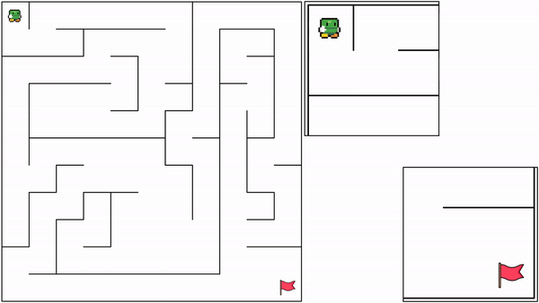

# Maze Game Server
A server that lets us create a maze based on a [text file](./mazepool/0.maze) with co-ordinates of walls and takes a command as an input and writes out the current position of bot and the walls around it to stdin, and reads in co-ordinates for the bot to move towards from stdout. Then captures and visualizes the movements of the bot into a video.

### Set-Up
1. Two ways to run the project:
   * Locally after installing all the dependecies
     * Install all the required dependencies, go to step 3.
   * In a docker container, using the Dockerfile in the repo, skip to step 4 after starting the container.
     * `docker build -t maze-game .`
     * `docker run --name=maze-game --detach maze-game`
     * Then you can use vscode to [connect](https://code.visualstudio.com/docs/devcontainers/containers) to attach to the container, go to step 4.
     * Or run `docker exec -it maze-game bash` to drop into bash inside the container, go to step 4.
2. Dependencies
   * [GraphicsMagick](www.graphicsmagick.org)
   * [FFmpeg](https://ffmpeg.org/)
   * [clang](https://clang.llvm.org/)
   * [boost](https://www.boost.org/)
   * [ghostscript](https://www.ghostscript.com/)
3. After installing the required dependencies, clone the repo.
4. run `make` to make the ./server executable.
5. run `make dfsbot` to create a visualization for a depth first search bot.

## Details
-  server can be run with `./server 'program/agent to run'` and communicates with the program passed to it using std-in/out.
   * example: `./server 'python dfbot.py'`
- For two players
  * It is `./server 'python3 agent1.py' 'python3 agent2.py'`
-  sends the sense data and bot location over std-in to be read and processed by the agent/program.
-  The agent should write the direction for the bot to move towards to std-out, which will be read by the server and bot will be moved, updated location of the bot is sent back to agent.
-  All the movements of the bot are captured into frames and stitched together into a video.

### Format of communication between server and agent
#### Bot Sense Information
- distance from walls in four directions is passed to std-in in this format
  - `wall x0 y0 x1 y1`
  - example: `wall 3.000000 1.000000 3.000000 2.000000`
- updated location of the bot
  - `bot x y num_coins`
  - example: `bot 2.014900 1.510483 3`
#### Adversarial Two Player information
- TWall
  - A temporary wall can be created to block the opponent agent in its track
  - This wall block the path for 15 seconds and costs 3 coins
  - Can only be deployed onto one of the walls in the current cell
  - `block tx ty [u|d|l|r]` example `block 1 2 d` creates bottom wall in the 1,2 cell
- Coins
  - Coins data is sent to the agent in the format
  - `Coin x0 y0`, the agent just needs to pass through it to collect it.
#### Agent to server
- direction to move the bot is sent over stdout(printed) in this format
  - `toward x y`
  - example: `toward 1.5 1.5`
### Server Defaults
- Server defaults to the `./mazepool/0.maze`, you can pick another by renaming the desired file to `0.maze` or changing the filename in `./maze-game-server.cpp`.
- The max number of seconds for the simulation, is set to 99. There is a chance that search wouldn't be complete in those seconds, you can increase|decrease it, but keep it mind, the resource consumption and time to process will change relatively.
- dfsbot.py can act as a template for agents, you can choose to use it as a base to make changes, or write one in another language based on it.
- server writes the mp4 file to out.mp4, it clears the out.mp4 at the start of next run for the new out.mp4.